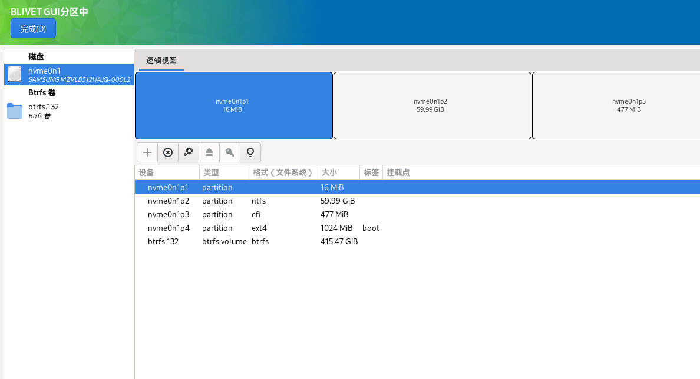
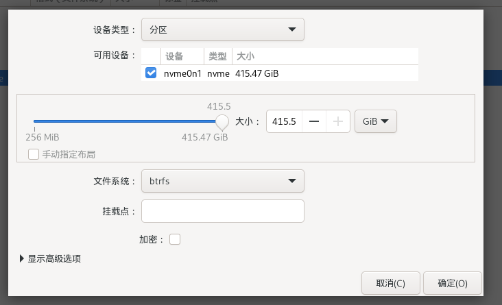
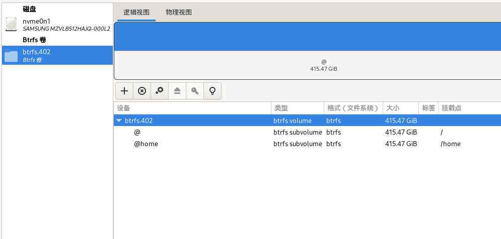

## 前言

TD;DR
Fedora 41系统安装教程，桌面环境配置为`Gnome47`，文件系统为`btrfs`。根据以下的安装教程，可以使用备份回滚神器`timeshift`。

个人常用的操作系统为Debian12，稳定是其最大的特点，但是带来的问题就是一些软件包过于老旧，不太适合开发使用。因此将桌面笔记本切换为Fedora，记录安装过程。

> Fedora Linux 是由 Fedora 项目社区开发、红帽公司赞助，目标是创建一套新颖、多功能并且自由（开放源代码）的操作系统。Fedora是商业化的Red Hat Enterprise Linux发行版的上游源码。Fedora对于用户而言，是一套功能完备、更新快速的免费操作系统；而对赞助者Red Hat公司而言，它是许多新技术的测试平台，被认为可用的技术最终会加入到Red Hat Enterprise Linux中。

## 操作步骤 🚀

### 初始准备工作

1. **准备镜像**
   从[清华镜像源](https://mirrors.tuna.tsinghua.edu.cn/#)获取Fedora操作系统ISO镜像。本文使用基于Gnome桌面环境的ISO文件：[Fedora-Workstation-Live-x86_64-41-1.4.iso](https://mirrors.tuna.tsinghua.edu.cn/fedora/releases/41/Workstation/x86_64/iso/Fedora-Workstation-Live-x86_64-41-1.4.iso)。

2. **制作启动U盘**
   使用[Ventoy](https://www.ventoy.net/)制作启动U盘，并将Fedora镜像文件拷贝到U盘中。

3. **设置U盘启动**
   重启进入BIOS，设置允许U盘启动。再次重启时按F12（具体热键因电脑而异）进入U盘启动盘。

4. **进入Live桌面**
   选择Fedora镜像，按Enter键进入Live桌面。可以选择体验系统，或直接点击“Install to Hard Drive”开始安装。

---

### 安装过程

#### 第一步：基本设置

1. **选择语言和时区**
   选择语言（中文）和时区（亚洲/上海），点击“继续”。

2. **选择安装位置**
   点击“安装位置”，进入磁盘分区界面。

#### 第二步：磁盘分区（关键步骤）

该步骤可以直接一劳永逸使用自动分区，默认设置文件系统为`btrfs`（不建议如此操作，后续timeshift发现不支持备份还原，丧失文件系统优势。）

1. **选择自定义分区**
   在“存储配置”中选择“高级自定义”，点击“完成”进入分区界面。
2. **分区规划**
   选择“标准分区”类型，删除已有分区并重新格式化。一般我们需要创建4个分区，建议创建以下分区：
   - **启动分区**:挂载点为`/boot`存放内核和引导文件，至少分配512MB（建议1GB）。
   - **ESP分区**: 挂载点为`/boot/efi`用于UEFI启动，至少分配200MB（建议512MB）。如果是双系统则是windows已经分配好的分区。
   - **根分区**: 挂载点为`/`用于系统相关目录。此处使用btrfs卷，标签为`@`。
   - **主目录分区**： 挂载点为`/home`用于用户文件，标签为`@home`。
   - **交换分区**（可选）： 不设挂载点，用于虚拟内存，建议分配2倍内存大小（内存充足可不设置）。



注意事项
1. 选择`Btrfs`文件系统，并合理划分子卷（如`@`、`@home`），以便使用Timeshift备份。
2. 给出的第一张示意图没有截图完整，上述的四个分区都必须挂载到位，也就是说必须包含`挂载点`。


正常安装完毕后直接进行重启，重启后需要设置用户名和密码。此处虽然有弱密码提示，但是仍然可以设置为简单密码。为方便使用还需进行如下的操作：换源、安装必要软件等。

到此Fedora的安装就已经完成了！是不是非常的简单~~

---

## 系统基本配置

### 软件源配置

1. 替换官方软件源

官方软件源一般架设在国外，国内获取速度较慢，所以一般需要手动将官方软件源切换到国内对应的镜像软件源，这里推荐中科大的ustc镜像源、清华的tuna镜像源。
注：本文选用中科大USTC的源，USTC提供换源命令，不用自己改文件，非常适合懒人！

执行USTC提供的换源命令：

```shell
sudo sed -e 's|^metalink=|#metalink=|g' -e 's|^#baseurl=http://download.example/pub/fedora/linux|baseurl=https://mirrors.ustc.edu.cn/fedora|g' -i.bak /etc/yum.repos.d/fedora.repo /etc/yum.repos.d/fedora-updates.repo
```

最后执行以下命令生成缓存：`sudo dnf makecache`,想要自己动手修改的也可以浏览器查找以下网站找到Fedora源来修改.注：镜像网站有很多不止这两个，这两个只是推荐，还有华为、阿里等
3. flatpak包支持

在类UNIX系统中，一个版本的软件只会存在系统中一份，依赖于该软件的其他软件在安装时，需要先解决依赖安装上所有对应的依赖包(很多软件发行还依赖于linux发行版的不同版本)。如果你想像Windows下一样，一个软件打包好所有的资源和依赖，各个软件之间独立存在，我想你需要flatpak。flatpak之类的打包方式在linux中还属于新事物，很多软件都还没有支持，所以能安装的软件不多，一般都是一些商业软件。

以下命令安装flatpak：`sudo dnf install flatpak`,添加flatpak的remote：
`sudo flatpak remote-add --if-not-exists flathub <https://flathub.org/repo/flathub.flatpakrepo>`,   删除remote:`sudo flatpak remote-delete flathub`,对于faltpak的使用，如果不懂的话还请移步浏览器查找官网找教学！

4. snap包支持

snap包是Canonical公司维护的一种新的打包系统，类似于红帽维护的flatpak。
该网址为snap官网应用商店：<https://snapcraft.io/store>

输入命令`sudo dnf install snap`安装snap,
安装软件中心的snap插件`sudo dnf install gnome-software-snap`.

5. 添加fedy源

fedy源可以方便在fedora上安装第三方软件，fedy为使用者准备了很多集成解决方案(比如mp3、Oracle Java)，依赖于RPMFusion源。

```shell
sudo dnf install <https://dl.folkswithhats.org/fedora/$(rpm> -E %fedora)/RPMS/fedy-release.rpm
sudo dnf install fedy
```

### 常用软件安装

0. 卸载不用的软件

```
sudo dnf remove gnome-tour gnome-boxes gnome-software flatpak gnome-connections gnome-contacts gnome-calendar mediawriter
sudo dnf install vim p7zip file-roller
```

1. 安装常用的软件

```shell
sudo dnf install zsh git curl wget terminator axel tmux fzf eza trash-cli unar
sudo dnf install akmod-nvidia # rhel/centos users can use kmod-nvidia instead
sudo dnf install xorg-x11-drv-nvidia-cuda #optional for cuda/nvdec/nvenc support
chsh -s /usr/bin/zsh
## 配置电源管理
sudo dnf install tlp tlp-rdw
sudo systemctl enable tlp.service --now
sudo systemctl mask systemd-rfkill.service
sudo systemctl mask systemd-rfkill.socket
```

zinit配置文件见[Zinit配置文件]()，安装完毕后运行`p10k configure`可以设置终端的配色主题方案。

2. Docker安装
现如今docker安装已经傻瓜脚本化，运行如下的脚本：

```shell
sudo curl -fsSL https://get.docker.com | bash -s docker --mirror Aliyun`，
sudo usermod -aG docker $USER
newgrp docker
sudo systemctl restart docker

```

### 系统配置修改

1. 修改dnf配置:修改/etc/dnf/dnf.conf配置文件（如果没什么需求可以不改，默认的就挺好用）

```conf
[main]
# 是否开启gpg校验
gpgcheck=1
# 允许保留多少旧内核包
installonly_limit=3
# 删除软件同时删除依赖包
clean_requirements_on_remove=True
# 查找最快镜像
fastestmirror=true
# 下载增量包
deltarpm=true
# 最大并发下载数量，在Fedora 35 中打开初始没有这项，可以不加
max_parallel_downloads=6
```

如果想使用dnf的图形化前端，可以运行`sudo dnf install dnfdragora`安装dnfdragora:

2. 修改SELinux配置

selinux是红帽系发行版自带的安全子系统，对于桌面版用户这个子系统意义不大，但是卸载不掉，只能完全禁用。查看SELinux状态:`/usr/sbin/sestatus -v`，如果状态是enabled，则代表SELinux开启，需要修改/etc/selinux/config配置文件，将SELINUX修改为disabled。

3. 家目录文件夹切换为英文

修改系统当前语言`export LANG=en_US`，通过命令修改主目录下的文件夹：`xdg-user-dirs-gtk-update`，将语言环境修改回中文：`export LANG=zh_CN.UTF-8`。

### 桌面环境美化

配置 GNOME 并进行基础美化：
sudo dnf install papirus-icon-theme gnome-tweaks gnome-extensions-app
打开 Gnome Tweak 启用 icon 主题并配置窗口右上角按键
打开 <https://extensions.gnome.org>
安装 blur-my-shell dash-to-panel appindicator
打开 Gnome Extension 启用上述插件并配置 dash-to-panel

---

## 总结 🎉

通过本教程，您可以顺利完成Fedora 41的安装，并配置Btrfs文件系统和Timeshift备份工具。同时，通过Gnome Tweaks和扩展，您可以打造一个高效、美观的桌面环境。Enjoy your Fedora journey! 🚀

---

### 参考链接 🔗

- [Fedora官方文档](https://docs.fedoraproject.org/)
- [GNOME Shell Extensions](https://extensions.gnome.org/)
- [Flatpak官网](https://flatpak.org/)
- [Snap官网](https://snapcraft.io/)
